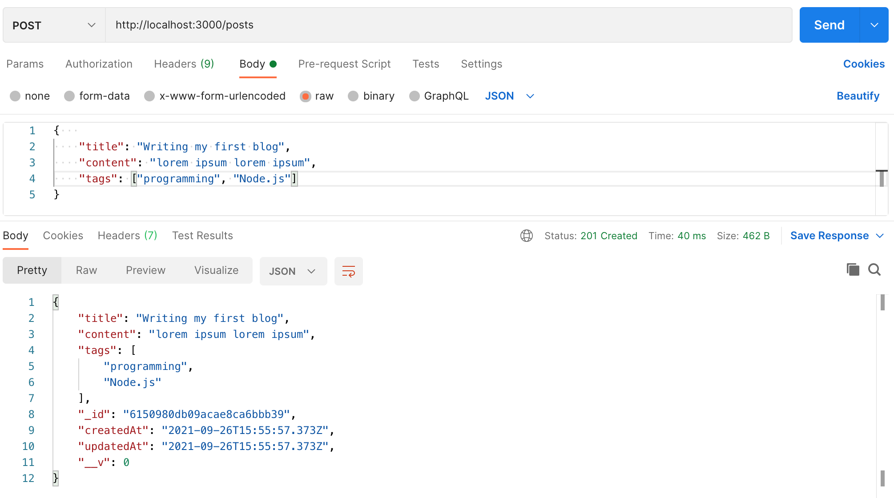

# Create and Read Data with Mongoose Lab

## Objectives

- Practice getting data from MongoDB using Mongoose
- Practice inserting data to the database

## Overview

Previously, we set up Mongoose and created our blog model schema, now it is time to interact with our database and manipulate the data.

## Instructions

#### Part 0: Getting all posts

When you call the endpoint `/blogposts` return all the posts as JSON.

#### Part 1: Inserting data

- Insert a new post with the "Ali" as the author name and "Node.js" as one of the tags to your blog database using a POST request
- It should return the post if data is inserted successfully and an error if not with the appropriate status code for both cases.

#### Part 2: Getting a single post using post id

Return a single post using the post **id** as a JSON object when calling the endpoint `/blogposts/POST_ID`, if the post wasn't found, return the error message with the appropriate status code.

#### Part 3: Filtering posts by tag name or author

When filtering a resource in REST, query parameters are added to the url after the "?" mark.

Your job is to:

- filter the posts according to the query parameters received in the request object. The request endpoint can be `/blogposts/filter`.
- if you received a query parameter "tags", filter posts according to the received tag.
- if you received a query parameter "author", filter posts according to the received author name.
- if you received both "tags" and "author" in the query parameters, then filter both tag and author.
- if no query parameters are received, return an error message asking the user to enter a valid query parameter with the appropriate status code.
